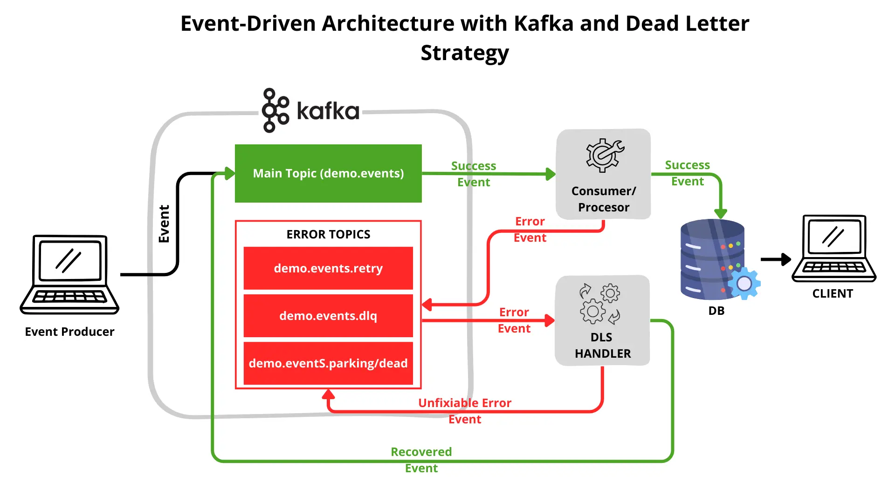
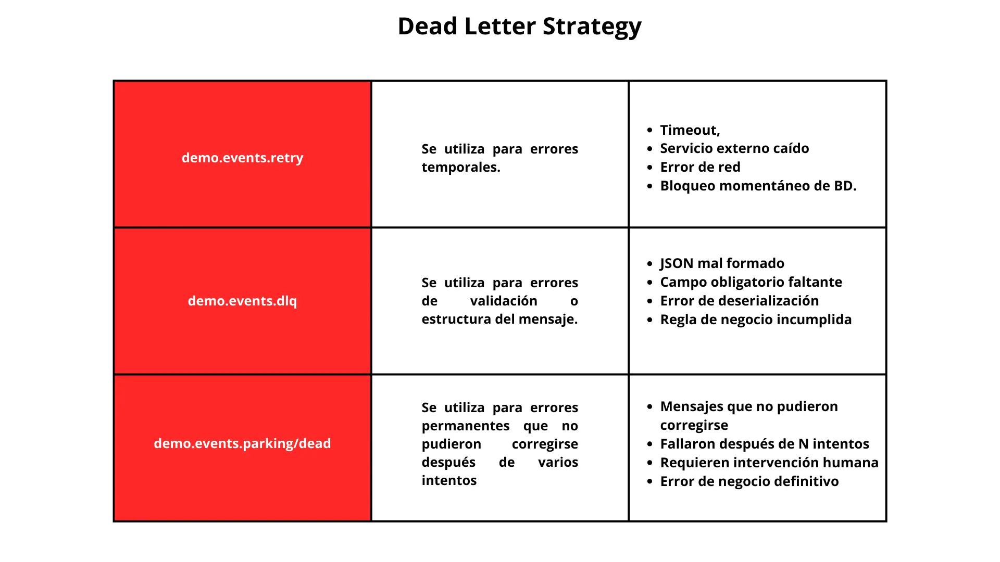

# Programa Básico practica Kafka, Consumer, Producers y Creación de Topico

Este proyecto demuestra una arquitectura Event-Driven resiliente utilizando Apache Kafka, donde se simula un flujo completo de eventos desde su producción hasta su consumo. El objetivo principal es entender cómo se crean y administran tópicos, cómo los productores publican eventos y cómo múltiples consumidores procesan esos mensajes de forma independiente, ademas de inlcuir una estrategia completa de manejo de errores conocida como **Dead Letter Strategy**, es clave en sistemas distribuidos donde la resiliencia y el control de errores son fundamentales.



## Creación de Tópicos en Kafka

El proyecto incluye la creación y consulta de tópicos en Kafka, permitiendo validar su existencia, configuración y correcto funcionamiento. Esta parte es clave para comprender cómo Kafka organiza y persiste los eventos dentro del broker antes de ser consumidos.


**1. Acceder al contenedor de Kafka**
```bash
# 1) Entra al contenedor de Kafka (para ejecutar comandos desde dentro)
docker exec -it kafka-broker bash
```

**1.1 Listar ejecutables para realizar distintas operaciones dentro de kafka:**
```bash
ls /opt/kafka/bin
```

**2. Creación de Topicos en Kafka**
```bash
# 2) Crear un tópico en Kafka
/opt/kafka/bin/kafka-topics.sh \
  --create \                              # Crea un tópico nuevo
  --topic demo.events \                   # Nombre del tópico
  --bootstrap-server localhost:9092 \     # Broker al que te conectas (desde el contenedor)
  --partitions 3 \                        # Particiones (paralelismo)
  --replication-factor 1                  # Replicación (1 broker = 1)
```

*Comando directo para copiar en consola:*
```bash
/opt/kafka/bin/kafka-topics.sh --create --topic demo.events --bootstrap-server localhost:9092 --partitions 3 --replication-factor 1
```

**3. Listar Topicos Existentes**
```bash
# 3) Listar todos los tópicos existentes
/opt/kafka/bin/kafka-topics.sh \
  --list \                               # Lista todos los tópicos
  --bootstrap-server localhost:9092      # Broker a consultar
```

*Comando directo para copiar en consola:*
```bash
/opt/kafka/bin/kafka-topics.sh --list --bootstrap-server localhost:9092
```

**4. Describir Topicos (Mostrar todas su descripcion)**
```bash
# 4) Describir un tópico (ver particiones, replicación, ISR, etc.)
/opt/kafka/bin/kafka-topics.sh \
  --describe \                           # Muestra detalle: particiones, replicas, ISR
  --topic demo.events \                  # Tópico a describir
  --bootstrap-server localhost:9092      # Broker a consultar
```

*Comando directo para copiar en consola:*
```bash
/opt/kafka/bin/kafka-topics.sh --describe --topic demo.events --bootstrap-server localhost:9092
```

**5. Eliminar Topicos**
```bash
# 5) (Opcional) Eliminar un tópico
/opt/kafka/bin/kafka-topics.sh \
  --delete \                             # Solicita eliminación del tópico
  --topic demo.events \                  # Tópico a borrar
  --bootstrap-server localhost:9092      # Broker a consultar
```

*Comando directo para copiar en consola:*
```bash
/opt/kafka/bin/kafka-topics.sh --delete --topic demo.events --bootstrap-server localhost:9092
```

**6. Verificar Consumidores en kafka**
```bash
/opt/kafka/bin/kafka-console-consumer.sh \
  --bootstrap-server localhost:9092 \
  --topic demo.events \
  --from-beginning \
  --property print.key=true \
  --property key.separator=" | " \
  --property print.timestamp=true
```

*Comando directo para copiar en consola:*
```bash
/opt/kafka/bin/kafka-console-consumer.sh --bootstrap-server localhost:9092 --topic demo.events --from-beginning --property print.key=true --property key.separator=" | " --property print.timestamp=true
```

**7. Salir del Contenedor**
```bash
exit
```

## Verificar Mensajes, Consumer Groups y Lag

**1. Ver mensajes + key + offset + partition**
```bash
/opt/kafka/bin/kafka-console-consumer.sh --bootstrap-server localhost:9092 --topic demo.events --from-beginning --property print.offset=true --property print.partition=true --property print.key=true --property key.separator=" | "
```

**2. Ver consumer groups existentes**
```bash
/opt/kafka/bin/kafka-consumer-groups.sh --bootstrap-server localhost:9092 --list
```
**3. Ver detalle de un consumer group (offset, lag, partition)**
```bash
/opt/kafka/bin/kafka-consumer-groups.sh --bootstrap-server localhost:9092 --describe --group NOMBRE_DEL_GROUP
```

## Dead Letter Strategy
Dead Letter Strategy es una estrategia de arquitectura utilizada en sistemas event-driven para gestionar mensajes que fallan durante su procesamiento, separándolos del flujo principal mediante tópicos especializados como retry, dead letter (DLQ) y parking lot.

Su objetivo es permitir reintentos controlados, aislar errores, evitar bloqueos del sistema y proporcionar mecanismos para recuperación automática o análisis manual, garantizando así la resiliencia y estabilidad del sistema.



## Producer

Se implementan producers encargados de generar eventos y publicarlos en los tópicos de Kafka. Estos productores representan las aplicaciones que emiten información al sistema, simulando eventos reales que posteriormente serán procesados por los consumidores.

## Consumidores

El proyecto cuenta con tres consumidores, cada uno suscrito a los tópicos correspondientes. Estos consumidores procesan los eventos de manera independiente, mostrando cómo Kafka permite el desacoplamiento entre productores y consumidores y facilita el procesamiento concurrente de mensajes.